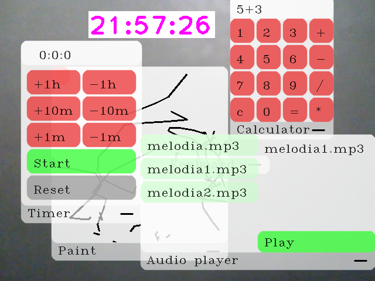

# AR headset soft v1.3.0

## Настройка
- Установите зависимости (pip install -r requirements.txt)
- Измените templates/index.html | div > img > width так, чтобы расстояние между картинками было равно 6см

## Использование
### Часы
Зажмите большой с указательным, чтобы передвигать

### Меню
Вытяните только указательный и мизинец для открытия

### Окна
Зажмите большой с указательным внизу, чтобы передвинуть на передней план и перемещать

Зажмите большой с указательным в нижнем правом углу, чтобы закрыть

### Кнопки
Нажатие - зажмите большой с указательным

### Paint
Зажмите большой с указательным, чтобы рисовать

Чтобы стереть, нажмите на красный квадрат

### Timer
h = часы

m = минуты

### Пакеты
Вы можете их найти в этом репозитории https://github.com/vladislav-serdyuk/AR_headset_pkgs

#### Установка и удаление
Запустите pkgmgr.py

Сначала введите
i - install, d - delete, q - quit

Потом Имя файла/Имя пакета

# [Для Разработчиков](docs/README_for_developers.md)
