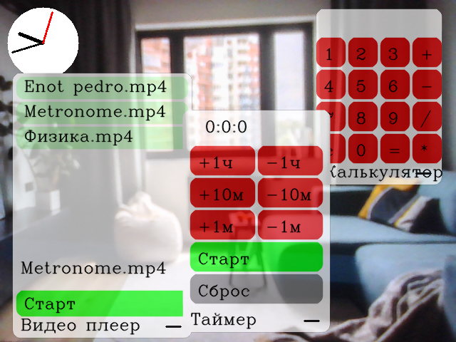

# AR_headset
# Ver: 1.0.1



## Важно
Библиотека opencv-python ver: 4.9.0.80 имеет дыру безопасности (CVE-2019-9423)
## Для пользователей
### Настройка
- Установите зависимости (pip install -r requirements.txt)
- Измените templates/index.html | div > img > width так, чтобы расстояние между картинками было равно 6см

### Использование
#### Часы
Зажмите большой с указательным, чтобы передвигать

Зажмите большой со средним, чтобы изменить тип

#### Меню
Вытяните только указательный и мизинец для открытия

#### Окна
Зажмите большой с указательным, чтобы передвигать

Зажмите большой с указательным в нижнем правом углу, чтобы закрыть

#### Кнопки
Нажатие - зажмите большой с указательным

#### Paint
Зажмите большой с указательным, чтобы рисовать

Зажмите большой с указательным в красном квадрате, чтобы стирать

#### Timer
h = часы

m = минуты

#### Пакеты
Вы можете их найти в этом репозитории https://github.com/vladislav-serdyuk/AR_headset_pkgs

##### Установка и удаление
Запустите pkgmgr.py

Сначала введите
i - install, d - delete, q - quit

Потом Имя файла/Имя пакета

## Для Разработчиков
### Назначение файлов
main.py: основной файл

GUIlib.py: Библиотека GUI

pkglist.json: хранит данные пакетов

templates/index.html: страница трансляции

templates/script.js: скрипт

pkg/pkg_name/: папка пакета pkg_name

pkg/pkg_name/run.py: главный файл пакета pkg_name

#### Структура pkglist.json
```
{
  "pkg1_name": {
    "dir": "pkg1_folder"
  },
  "pkg2_name": {
    "dir": "pkg2_folder"
  }
}
```

### Функции и методы
#### main.py
```
def process_image(frame: np.ndarray):
    """
    Распознаёт руки и накладывает на изображение интерфейс
    :param frame: входное изображение
    """
    ...

@app.route('/')
def index() -> str: ...


@app.route('/video_feed')
def video_feed() -> Response: ...


@app.route('/script.js')
def script() -> str: ...


def get_frame() -> Generator[bytes, Any, None]:
    """
    Получает изображение с камеры, обрабатывает, отправляет клиенту
    :return: Generator[bytes, Any, None]
    """
    ...

# setting
debug = True
hand_on_gui = True
show_window = True

```

#### GUIlib.py
```
import cv2
import numpy as np


class GUI:
    def __init__(self):  # setup position
        self.h = 50
        self.w = 50
        self.x = 10
        self.y = 10

    def __call__(self, img: np.ndarray, fingers_up: list[int], fingers_touch: list[int], landmark: list[list[int]],
                 buffer: list[str]): ...  # track finger


class WindowGUI(GUI):
    def __init__(self):
        super().__init__()
        self.hide = True
        self.background_color = (255, 255, 255)
        self.name = 'window'
        self.title_color = (0, 0, 0)
        self.win_h = 100
        self.win_w = 210
        self.h = 30
        self.w = self.win_w - 50
        self.x = 200
        self.y = 400

    def __call__(self, img: np.ndarray, fingers_up: list[int], fingers_touch: list[int], landmark: list[list[int]],
                 buffer: list[str]): ... # window rander

    def rectangle(self, img: np.ndarray, x: int, y: int, w: int, h: int, color: tuple[int, int, int], radius=10,
                  thickness=-1, line_type=cv2.LINE_AA):
        """
        Рисует прямоугольник
        :param img: где рисовать
        :param x: x координата верхний правой точки
        :param y: y координата верхний правой точки
        :param w: ширина
        :param h: высота
        :param color: цвет
        :param radius: закругление углов
        :param thickness: толщина
        :param line_type: тип линии
        :return:
        """
        ...

    def text(self, img: np.ndarray, x: int, y: int, text: str, color: tuple[int, int, int],
         text_fontFace=cv2.FONT_HERSHEY_COMPLEX_SMALL, text_fontScale=1):
        """
        Рисует текст
        :param img: где рисовать
        :param x: x координата нижней левой точки
        :param y: y координата нижней левой точки
        :param text: текст
        :param color: цвет
        :param text_fontFace: шрифт
        :param text_fontScale: размер
        :return:
        """
        ...

    def button(self, img: np.ndarray, x: int, y: int, w: int, h: int, text: str, color: tuple[int, int, int],
           action: typing.Callable[[], None], fingers_touch: list[int], landmark: list[list[int]],
           text_color=(0, 0, 0), text_fontFace=cv2.FONT_HERSHEY_COMPLEX_SMALL, text_fontScale=1):
        """
        Рисует кнопку
        :param img: где рисовать
        :param x: x координата верхний правой точки
        :param y: y координата верхний правой точки
        :param w: ширина
        :param h: высота
        :param text: текст
        :param color: цвет
        :param action: действие при нажатии
        :param fingers_touch: list[int]
        :param landmark: list[list[int]]
        :param text_color: цвет текста
        :param text_fontFace: шрифт
        :param text_fontScale: размер
        :return:
        """
        ...

    def add_img(self, img: np.ndarray, x: int, y: int, img2: np.ndarray):
        """
        Добавляет изображение
        :param img: куда добавлять
        :param x: x координата верхний правой точки
        :param y: y координата верхний правой точки
        :param img2: Что добавлять
        :return:
        """
        ...

```

### Buffer
Buffer представляет собой list[str] и нужен для обмена информацией между приложениями

Приложения должны добавлять данные в конец, а доставать из начала или конца

### Создание пакета
Создайте папку

В ней создайте файл pkg_data.json и папку files

В папке files создайте run.py

run.py:
```
import numpy as np
import cv2

from GUIlib import WindowGUI


class App(WindowGUI):
    def __init__(self):
        super().__init__()
        self.win_h = 200
        self.win_w = 200
        self.name = 'My App' # = pkg_data.json["info"]

    def __call__(self, img, fingers_up, fingers_touch, landmark, buffer: list):
        super().__call__(img, fingers_up, fingers_touch, landmark, buffer)
        if self.hide:
            return
        ...

```

pkg_data.json:
```
{
  "name": "my_pkg",
  "dir": "myPkg",
  "info": "My App"
}
```

Упакуйте **содержимое** в zip (**не папку!!!**)
